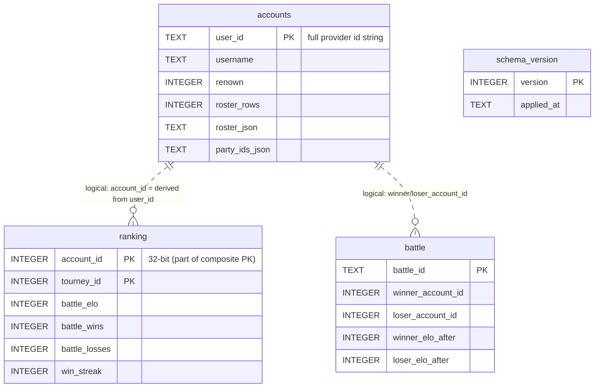

# Database Schema Reference

The BSF custom server stores all persistent state in a single SQLite database (`DB_PATH`, default `data/bsf.db`, WAL mode). There is no separate init step: `src/db/connection.ts` creates the base tables inline on startup (`CREATE TABLE IF NOT EXISTS`), then `src/db/migrations.ts` applies every file under `src/db/migrations/` that hasn't run yet. This doc enumerates every table, its columns, and the code that reads and writes it.

> **Two sources of schema truth.** The `accounts` table is defined **inline** in `connection.ts` (the fresh-install base). The `ranking`, `battle`, and `schema_version` tables are defined in **migration files**. The inline `CREATE … IF NOT EXISTS` only does work on a brand-new database, so on an existing install *only migrations change the schema* — see [`database-migrations.md`](./database-migrations.md). When you change an inline table you **must** also ship a migration, or fresh installs and existing installs silently diverge.
>
> **This doc grows.** Issues #91 (friends list) and #29 (registration without Steam) will add tables; update the relevant section and the ER diagram when they land.

## Entity relationships

**There are no SQL `FOREIGN KEY` constraints** between these tables — the relationships above are logical only. Note the **key mismatch**: `accounts` is keyed by `user_id` (the *full* provider id string — a 64-bit Steam ID or a Discord snowflake), while `ranking` and `battle` are keyed by `account_id` (the *32-bit* in-game id, derived at runtime as `user_id - 76561197960265728` for Steam users). The 32-bit value is **not stored** in `accounts`; it is computed on the `Session`. See [ARCHITECTURE.md → Key Design Decisions](./ARCHITECTURE.md#key-design-decisions) for why in-game data uses the 32-bit form.

> **Doc-vs-rule drift to fix:** `.claude/rules/db.md` refers to a `steam_id` column on `accounts`. No such column exists — the full provider id lives in the `user_id` TEXT primary key. Treat this doc as authoritative.

---

## `accounts`

Per-player profile, roster, and party. Defined inline in `src/db/connection.ts`; the `completed_tutorial` default was later flipped `1 → 0` by migration `002` (existing rows keep their value).

| Column | Type | Constraints | Meaning |
|---|---|---|---|
| `user_id` | TEXT | NOT NULL, PRIMARY KEY | Full provider id **as a string** — 64-bit Steam ID or Discord snowflake. Kept as text to preserve precision above 2^53. |
| `username` | TEXT | NOT NULL | Display name. |
| `renown` | INTEGER | NOT NULL DEFAULT 0 | Soft currency. |
| `daily_login_streak` | INTEGER | NOT NULL DEFAULT 1 | Not auto-incremented by the server today (see gotchas). |
| `login_count` | INTEGER | NOT NULL DEFAULT 1 | Bumped by `upsertAccount` on each login. |
| `completed_tutorial` | INTEGER | NOT NULL DEFAULT 0 | `0` for fresh accounts after migration `002`; lets us tell new players from returning ones. |
| `roster_rows` | INTEGER | NOT NULL DEFAULT 1 | Number of barracks **grid rows** (not unit count). Capacity = `roster_rows × UNITS_PER_ROW (9)`, capped at `MAX_ROSTER_ROWS (8)`. |
| `roster_json` | TEXT | NOT NULL DEFAULT `'[]'` | The player's full roster (array of unit `EntityDef`s) as JSON. |
| `party_ids_json` | TEXT | NOT NULL DEFAULT `'[]'` | Ordered list of the unit ids in the active party. **Order drives battle turn order** (#71). |
| `created_at` | TEXT | NOT NULL DEFAULT `datetime('now')` | Row creation time. |
| `updated_at` | TEXT | NOT NULL DEFAULT `datetime('now')` | Last-write time. |

**Writers** (`src/db/account.ts`): `upsertAccount` (INSERT … ON CONFLICT(user_id) DO UPDATE login_count), `addRenown`, `saveParty`, `saveRoster`, `saveRosterAndSpendRenown`, `saveRosterAndParty`, `saveRosterAndAddRenown`, `markTutorialComplete`, `expandBarracks`.
**Readers:** `getAccountByUserId` (alias `getAccountById`), `parseRow`. The result is cached on `session.accountData` and treated as the in-memory source of truth for the session lifetime.

> **Where these two columns end up.** `roster_json` and `party_ids_json` arrive at the game client as `legend.roster` and `legend.party` — see `bsf-client/docs/data-model.md` §5 "Your account and roster" ([local](../../bsf-client/docs/data-model.md) | [GitHub](https://github.com/Banner-Saga-Factions/BSF-Client/blob/master/docs/data-model.md)). Worth knowing before you go looking elsewhere: in battle a unit fights with **its own roster numbers**, so these two columns — not any stat block sent at battle time — decide how strong a unit actually is. Full statement of that rule: [`../.claude/rules/gotchas.md`](../.claude/rules/gotchas.md).

> **Invariant:** only `upsertAccount` and `expandBarracks` may write `roster_rows`. The `saveRoster*` helpers update `roster_json` (and renown/party as applicable) but must **never** touch `roster_rows`, or paid barracks expansions silently revert. Enforced by convention + `.claude/rules/db.md`.

---

## `battles`  *(removed in migration 003)*

The original thin results table — dropped by migration `003` (2026-07-22). Its writer (`saveBattleResult`) was removed in #43 and the richer `battle` table (below) replaced it; nothing read or wrote it afterward. Kept here only so anyone reading older code or backups knows where it went. **Do not re-add it.**

---

## `ranking`

Per-player, per-tournament Elo and win/loss record. Ported from the 2013 Java server's schema-4 `ranking` table (`bsf-refs/server-2013-java/db/game/4/apply.sql`). Defined in migration `001_ranking_and_battle.sql`.

| Column | Type | Constraints | Meaning |
|---|---|---|---|
| `account_id` | INTEGER | NOT NULL | 32-bit in-game id. |
| `tourney_id` | INTEGER | NOT NULL DEFAULT 0 | `0` = the global (non-tournament) ladder. |
| `battle_wins` | INTEGER | NOT NULL DEFAULT 0 | |
| `battle_losses` | INTEGER | NOT NULL DEFAULT 0 | |
| `battle_elo` | INTEGER | NOT NULL DEFAULT 1000 | `ELO_BEGIN = 1000`. |
| `win_streak` | INTEGER | NOT NULL DEFAULT 0 | Current streak; feeds the STREAK renown award (read **pre-update** at endgame). |
| `best_win_streak` | INTEGER | NOT NULL DEFAULT 0 | High-water mark. |
| `friend_battles` | INTEGER | NOT NULL DEFAULT 0 | Reserved for the deferred FRIEND award. |

**Primary key:** composite `(account_id, tourney_id)`.
**Indexes:** `idx_ranking_tourney (tourney_id)` — added in migration `003`; lets the leaderboard read one ladder's rows through the index instead of scanning the whole table.
**Writers** (`src/db/ranking.ts`): `getOrCreateRanking` (INSERT OR IGNORE + SELECT, default row on miss), `applyBattleRankingUpdate` (single-statement UPDATE of elo + win/loss + streak; streak rules mirror Java `BattleRanking.incrementWins/Losses`).
**Readers:** endgame Elo calc (`src/services/battle/Battle.ts`), leaderboard build (`src/db/leaderboard.ts` `buildLeaderboards`, used by `/game/leaderboards`).

---

## `battle`

The full per-battle record (per-side Elo before/after, renown, kills, surrender flag, party snapshot). Ported from the 2013 schema-5 `battle` table plus BSF additions for leaderboards and replay parity. Defined in migration `001_ranking_and_battle.sql`.

| Column | Type | Constraints | Meaning |
|---|---|---|---|
| `battle_id` | TEXT | NOT NULL, PRIMARY KEY | |
| `battle_type` | TEXT | NOT NULL | `QUICK` / `RANKED` / `TOURNEY`. |
| `battle_scene` | TEXT | | Map id (e.g. `greathall`). |
| `battle_create_time` | INTEGER | NOT NULL | Epoch-ms. |
| `battle_end_time` | INTEGER | | Epoch-ms. |
| `battle_victor_team` | TEXT | | Winner's `account_id` as a string. |
| `battle_surrender` | INTEGER | NOT NULL DEFAULT 0 | `1` if won by surrender. |
| `battle_turns` | INTEGER | | Turn count (the per-turn log itself is not persisted — #41). |
| `battle_aborted` | INTEGER | NOT NULL DEFAULT 0 | |
| `battle_renown` | INTEGER | NOT NULL DEFAULT 0 | Combined renown awarded. |
| `winner_account_id` / `loser_account_id` | INTEGER | | 32-bit ids. |
| `winner_renown` / `loser_renown` | INTEGER | NOT NULL DEFAULT 0 | Per-side renown. |
| `winner_kills` / `loser_kills` | INTEGER | NOT NULL DEFAULT 0 | Per-side kill counts. |
| `winner_elo_before` / `winner_elo_after` | INTEGER | | |
| `loser_elo_before` / `loser_elo_after` | INTEGER | | |
| `parties_json` | TEXT | | Both parties' snapshot (session keys stripped before write). |

Indexes: `idx_battle_winner (winner_account_id)`, `idx_battle_loser (loser_account_id)`, `idx_battle_end (battle_end_time)`.
**Writer** (`src/db/battles.ts`): `saveBattle(BattleRow)`, called once per battle from `endgame()`.
**Readers:** none yet — written for future replay/parity tooling (integration-plan M6).

---

## `schema_version`

Bookkeeping for the migration runner: one row per applied migration. Created and written by `runMigrations` in `src/db/migrations.ts`.

| Column | Type | Constraints |
|---|---|---|
| `version` | INTEGER | NOT NULL, PRIMARY KEY |
| `applied_at` | TEXT | NOT NULL DEFAULT `datetime('now')` |

A migration file `NNN_*.sql` is skipped if its `NNN` already appears here. See [`database-migrations.md`](./database-migrations.md).

---

*Last updated: 2026-07-25. Source of truth: `src/db/connection.ts` (inline base) + `src/db/migrations/*.sql` (deltas). Compare against the original MySQL schema 88 at `%USERPROFILE%\Code\bsf-refs\server-2013-java\db\game\0\schema.sql` when porting columns.*
